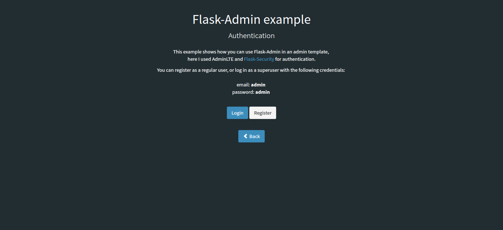
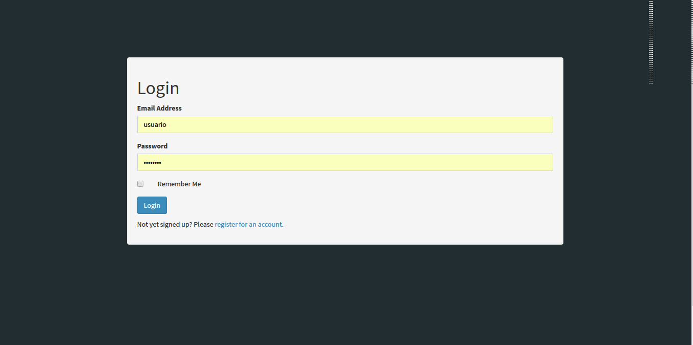
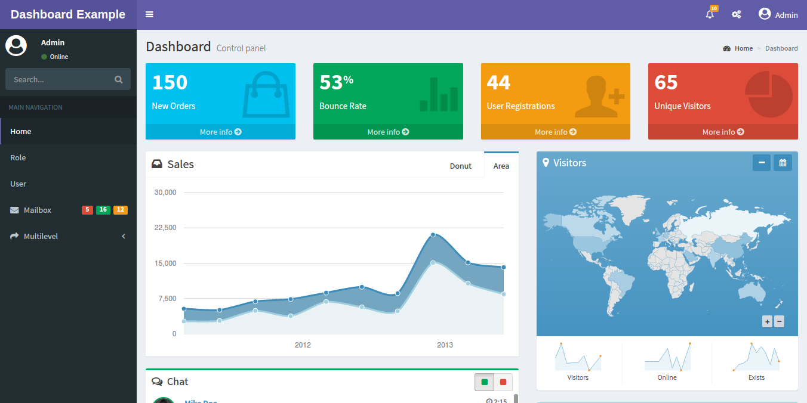

# Flask-Admin Dashboard Example

Basic dashboard app (skeleton), with boostrap 3.7 template and Flask Admin it has:

- User Registration
- Log in as general or admin user
- Roles creation
- Organize menu items at left in a vertical menu
- Modern view with a top navbar where you can place notifications
- Menu Hide onclick
- Create form in modal window by default
- Inline editing enabled by default
- Skins and  layout customization
- Home page has charts, chat and calendar examples 
 
It uses: 

  - AdminLTE Bootstrap template
  - Flask-Security
  - Flask-Admin
  - A lot of Charts libraries
  - SQLite


### How to use

- Clone or download the git repository.
    ```sh
    $ git clone https://github.com/jonalxh/Flask-Admin-Dashboard.git
    ```
- Create and activate a virtual environment:
    ```sh
    $ virtualenv env
    $ source env/bin/activate
    ```
- Install the requirements inside the app folder
    ```sh
    $ sudo pip install -r requirements.txt
    ```
- Once the process finishes just execute the app.py file
    ```sh
    $ python app.py
    ```
- The first execution will create automatically a sample sqlite database.
- Open your prefered browser and type
    ```
    localhost:5000/admin
    ```
    then just log in with the default user or register one. 

### Screenshots






**I hope you enjoy it.**
